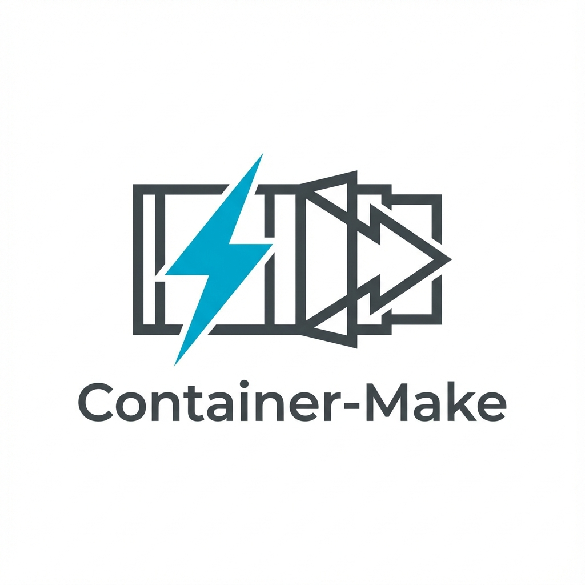

<div align="center">



# ⚡ CONTAINER-MAKER

### The Ultimate Developer Experience Platform for the Container Era

<p>
    <a href="https://golang.org"></a>
    <a href="LICENSE"></a>
    <a href="#"></a>
</p>

<p>
    <a href="#-quick-start"><b>Quick Start</b></a> •
    <a href="#-core-features"><b>Features</b></a> •
    <a href="#-cloud-control-plane"><b>Cloud</b></a> •
    <a href="#-command-reference"><b>Commands</b></a> •
    <a href="README_CN.md"><b>中文文档</b></a>
</p>

<br>

**Container-Maker (cm)** fuses the speed of Makefiles, the isolation of Docker, and the intelligence of VS Code DevContainers into a single, zero-configuration CLI that transforms any machine into a production-grade development studio.

</div>

---

## 📑 Table of Contents

- [What is Container-Maker?](#-what-is-container-maker)
- [Quick Start](#-quick-start)
  - [Installation](#installation)
  - [5-Minute Tutorial](#5-minute-tutorial)
- [Core Features](#-core-features)
  - [Zero-Config Onboarding](#1-zero-config-onboarding-cm-setup)
  - [Environment Diagnostics](#2-environment-diagnostics-cm-doctor)
  - [Project Initialization](#3-project-initialization-cm-init)
  - [Container Interaction](#4-container-interaction-cm-shell--run--exec)
  - [AI Configuration](#5-ai-configuration-cm-ai-generate)
  - [Template Marketplace](#6-template-marketplace-cm-marketplace)
  - [VS Code Integration](#7-vs-code-integration-cm-code)
- [Advanced Features](#-advanced-features)
  - [DevContainer Features (OCI)](#devcontainer-features-oci)
  - [Docker Compose Integration](#docker-compose-integration)
  - [Intelligent Caching](#intelligent-caching)
  - [Port Forwarding](#port-forwarding)
  - [File Watching](#file-watching-cm-watch)
  - [Security Scanning](#security-scanning)
- [Cloud Control Plane](#-cloud-control-plane)
  - [Overview](#overview)
  - [Supported Providers](#supported-providers-14)
  - [CLI Integration](#cli-integration)
  - [Web Dashboard](#web-dashboard)
- [TUI Dashboard](#-tui-dashboard)
- [Template Library](#-template-library)
- [Command Reference](#-command-reference)
- [Configuration Reference](#-configuration-reference)
- [Clever Design Details](#-clever-design-details)
- [Security](#-security)
- [FAQ](#-faq)
- [Contributing](#-contributing)
- [License](#-license)

---

## 🎯 What is Container-Maker?

Container-Maker solves the **"works on my machine"** problem once and for all while delivering a seamless developer experience.

<table>
<tr>
<td width="33%" valign="top">

### 🎯 Single Source of Truth
Your `devcontainer.json` defines the entire universe. No more maintaining separate Dockerfiles, Makefiles, or shell scripts.

</td>
<td width="33%" valign="top">

### 💎 Native Fidelity
`vim`, `htop`, and interactive shells work exactly as they do locally. Custom signal proxy handles window resizing (SIGWINCH) perfectly.

</td>
<td width="33%" valign="top">

### 🚀 BuildKit Powered
Leverages Docker BuildKit for aggressive layer caching. Your environment spins up in seconds, not minutes.

</td>
</tr>
</table>

### Comparison

| Feature | Docker CLI | VS Code DevContainers | **Container-Maker** |
|---------|------------|----------------------|---------------------|
| Zero-config startup | ❌ | ⚠️ Requires VS Code | ✅ |
| Standalone CLI | ✅ | ❌ | ✅ |
| AI config generation | ❌ | ❌ | ✅ |
| Cloud deployment | ❌ | ❌ | ✅ |
| TUI dashboard | ❌ | ❌ | ✅ |
| Template marketplace | ❌ | ⚠️ Limited | ✅ |
| Multi-runtime support | ⚠️ Docker only | ⚠️ Docker only | ✅ Docker/Podman |

---

## 🚀 Quick Start

### Installation

#### Option 1: Download Prebuilt Binary (Recommended)

```bash
# Windows (PowerShell)
irm https://github.com/UPwith-me/Container-Maker/releases/latest/download/cm-windows-amd64.exe -OutFile cm.exe

# Linux / macOS
curl -Lo cm https://github.com/UPwith-me/Container-Maker/releases/latest/download/cm-linux-amd64
chmod +x cm && sudo mv cm /usr/local/bin/
```

#### Option 2: Go Install

```bash
go install github.com/UPwith-me/Container-Maker/cmd/cm@latest
```

#### Option 3: Build from Source

```bash
git clone https://github.com/UPwith-me/Container-Maker.git
cd Container-Maker
go build -o cm ./cmd/cm
```

### 5-Minute Tutorial

```bash
# Step 1: Auto-detect and install Docker/Podman
cm setup

# Step 2: Initialize a new project with AI assistance
cm init --template python

# Step 3: Enter the container
cm shell

# Step 4: Run commands
cm run python main.py

# Step 5: Open in VS Code
cm code
```

---

## ✨ Core Features

### 1. Zero-Config Onboarding (`cm setup`)

Automatically detects your OS and installs the optimal container runtime.

```bash
cm setup
```

- **Windows**: Installs Docker Desktop or WSL2 + Docker
- **Linux**: Installs Docker CE or Podman
- **macOS**: Installs Docker Desktop or Colima

### 2. Environment Diagnostics (`cm doctor`)

Deep health checks for your development environment.

```bash
cm doctor
```

Checks include:
- ✅ Container runtime (Docker/Podman)
- ✅ GPU support (NVIDIA/AMD)
- ✅ Network connectivity
- ✅ Disk space
- ✅ Docker Compose availability

### 3. Project Initialization (`cm init`)

Create new projects from curated templates or let AI generate configurations.

```bash
# Interactive mode
cm init

# Use a specific template
cm init --template pytorch

# AI-powered generation
cm ai generate
```

### 4. Container Interaction (`cm shell` / `run` / `exec`)

Multiple ways to interact with your container:

| Command | Description | Use Case |
|---------|-------------|----------|
| `cm shell` | Start persistent container and attach | Interactive development |
| `cm run <cmd>` | Run command in ephemeral container | One-off builds |
| `cm exec <cmd>` | Execute in running container | Hot-reload scenarios |

```bash
# Start a shell session
cm shell

# Run tests
cm run pytest tests/

# Execute in background container
cm exec npm run build
```

### 5. AI Configuration (`cm ai generate`)

Let AI analyze your project and generate optimized configurations.

```bash
cm ai generate
```

- Analyzes `package.json`, `requirements.txt`, `go.mod`, etc.
- Suggests optimal base images
- Configures caching strategies
- Adds appropriate VS Code extensions

### 6. Template Marketplace (`cm marketplace`)

Browse and install community templates.

```bash
# Search templates
cm marketplace search pytorch

# List GPU-accelerated templates
cm marketplace search --gpu

# Install a template
cm marketplace install ml-pytorch
```

### 7. VS Code Integration (`cm code`)

Open your project in VS Code with full DevContainer support.

```bash
cm code
```

- Automatically detects `devcontainer.json`
- Launches VS Code with Remote-Containers
- Works with local and remote containers

---

## 🔧 Advanced Features

### DevContainer Features (OCI)

Install additional tools from OCI registries:

```bash
# Add Go to your container
cm feature add ghcr.io/devcontainers/features/go

# Add Docker-in-Docker
cm feature add ghcr.io/devcontainers/features/docker-in-docker
```

### Docker Compose Integration

Seamlessly works with `docker-compose.yml`:

```json
{
  "dockerComposeFile": "docker-compose.yml",
  "service": "app",
  "workspaceFolder": "/workspace"
}
```

### Intelligent Caching

Automatic persistent caching for major languages:

| Language | Cache Path | Speed Improvement |
|----------|------------|-------------------|
| Go | `/go/pkg/mod` | Up to 10x |
| Node.js | `node_modules` | Up to 5x |
| Rust | `/usr/local/cargo` | Up to 8x |
| Python | `~/.cache/pip` | Up to 3x |
| Java | `~/.m2` | Up to 4x |

### Port Forwarding

Automatic detection and forwarding:

```json
{
  "forwardPorts": [3000, 8080, "5432:5432"]
}
```

Supports:
- Single ports: `3000`
- Port ranges: `8000-8010`
- Mappings: `"host:container"`

### File Watching (`cm watch`)

Auto-run commands on file changes:

```bash
# Watch and run tests
cm watch --run "pytest tests/"

# Watch with custom patterns
cm watch --pattern "*.py" --run "python main.py"
```

### Security Scanning

Proactive security warnings:

```bash
cm doctor --security
```

Detects:
- ⚠️ Docker socket mounts
- ⚠️ Privileged mode
- ⚠️ Sensitive environment variables
- ✅ Suggests Rootless Docker alternatives

---

## ☁️ Cloud Control Plane

Container-Maker Cloud extends your local development to the cloud with on-demand GPU instances.

### Overview

- **One-Click GPU Access**: Provision NVIDIA T4, A10, A100 instances
- **14+ Cloud Providers**: AWS, GCP, Azure, DigitalOcean, and more
- **Pay-as-you-go**: No upfront costs, billed by the second
- **Seamless CLI Integration**: `cm cloud` commands

### Supported Providers (14+)

| Provider | GPU Support | Regions |
|----------|-------------|---------|
| AWS EC2 | ✅ | 25+ |
| Google Cloud | ✅ | 35+ |
| Azure | ✅ | 60+ |
| DigitalOcean | ❌ | 14 |
| Hetzner | ❌ | 5 |
| Linode | ✅ | 11 |
| Vultr | ✅ | 25 |
| OCI (Oracle) | ✅ | 41 |
| Lambda Labs | ✅ | 5 |
| RunPod | ✅ | 10+ |
| Vast.ai | ✅ | Community |
| Paperspace | ✅ | 6 |
| CoreWeave | ✅ | 3 |
| Docker (Local) | ✅ | - |

### CLI Integration

```bash
# Login to cloud
cm cloud login

# List available instances
cm cloud instances

# Create a GPU instance
cm cloud create --provider aws --type gpu-t4 --name ml-training

# Connect via SSH
cm cloud connect <instance-id>

# Stop instance
cm cloud stop <instance-id>

# Delete instance
cm cloud delete <instance-id>
```

### Web Dashboard

Access the full-featured web dashboard:

```bash
# Start the local dashboard
cm cloud dashboard

# Or access the hosted version
# https://cloud.container-maker.dev
```

Features:
- Real-time instance monitoring
- WebSocket-based log streaming
- Interactive terminal
- Usage analytics and billing

---

## 📊 TUI Dashboard

Beautiful terminal UI for monitoring your containers.

```bash
cm status
```

Or simply run `cm` without arguments to launch the home screen.

Features:
- Container list with status
- Resource usage (CPU/Memory)
- Log streaming
- Quick actions (Start/Stop/Delete)

---

## 📦 Template Library

17+ curated templates for various use cases:

### AI/ML
| Template | Description |
|----------|-------------|
| `pytorch` | PyTorch with CUDA support |
| `tensorflow` | TensorFlow 2.x with GPU |
| `huggingface` | Transformers + Datasets |
| `jupyter` | JupyterLab with scientific stack |

### Web Development
| Template | Description |
|----------|-------------|
| `node` | Node.js 20 LTS |
| `react` | React + Vite |
| `nextjs` | Next.js 14 |
| `python-web` | FastAPI / Django |

### Systems Programming
| Template | Description |
|----------|-------------|
| `go` | Go 1.21+ |
| `rust` | Rust + Cargo |
| `cpp` | C++ with CMake |

### DevOps
| Template | Description |
|----------|-------------|
| `terraform` | Terraform + Cloud CLIs |
| `kubernetes` | kubectl + Helm |
| `ansible` | Ansible + Python |

---

## 📖 Command Reference

### Core Commands

| Command | Description | Example |
|---------|-------------|---------|
| `cm` | Launch TUI home screen | `cm` |
| `cm init` | Initialize new project | `cm init --template python` |
| `cm shell` | Enter persistent container | `cm shell` |
| `cm run <cmd>` | Run command in container | `cm run make build` |
| `cm exec <cmd>` | Execute in running container | `cm exec npm test` |
| `cm prepare` | Build container image | `cm prepare` |

### Environment Commands

| Command | Description | Example |
|---------|-------------|---------|
| `cm setup` | Install container runtime | `cm setup` |
| `cm doctor` | Run diagnostics | `cm doctor` |
| `cm status` | Show TUI dashboard | `cm status` |
| `cm code` | Open in VS Code | `cm code` |

### AI & Templates

| Command | Description | Example |
|---------|-------------|---------|
| `cm ai generate` | AI-generate config | `cm ai generate` |
| `cm marketplace search` | Search templates | `cm marketplace search --gpu` |
| `cm marketplace install` | Install template | `cm marketplace install pytorch` |
| `cm template list` | List local templates | `cm template list` |

### Cloud Commands

| Command | Description | Example |
|---------|-------------|---------|
| `cm cloud login` | Authenticate | `cm cloud login` |
| `cm cloud instances` | List instances | `cm cloud instances` |
| `cm cloud create` | Create instance | `cm cloud create --type gpu-t4` |
| `cm cloud connect` | SSH into instance | `cm cloud connect abc123` |
| `cm cloud stop` | Stop instance | `cm cloud stop abc123` |
| `cm cloud delete` | Delete instance | `cm cloud delete abc123` |

### Advanced Commands

| Command | Description | Example |
|---------|-------------|---------|
| `cm feature add` | Add OCI feature | `cm feature add ghcr.io/devcontainers/features/go` |
| `cm feature list` | List features | `cm feature list` |
| `cm cache clean` | Clear build cache | `cm cache clean` |
| `cm watch` | Watch file changes | `cm watch --run "pytest"` |
| `cm backend` | Manage runtimes | `cm backend list` |
| `cm clone` | Clone + enter container | `cm clone github.com/user/repo` |

---

## ⚙️ Configuration Reference

### devcontainer.json

```jsonc
{
  // Base image or Dockerfile
  "image": "mcr.microsoft.com/devcontainers/go:1.21",
  // Or use a Dockerfile
  "build": {
    "dockerfile": "Dockerfile",
    "context": ".",
    "args": { "VARIANT": "1.21" }
  },

  // Container options
  "runArgs": ["--cap-add=SYS_PTRACE"],
  "mounts": ["source=go-mod,target=/go/pkg/mod,type=volume"],
  "containerEnv": {
    "CGO_ENABLED": "0"
  },

  // Lifecycle commands
  "postCreateCommand": "go mod download",
  "postStartCommand": "echo 'Ready!'",

  // DevContainer Features
  "features": {
    "ghcr.io/devcontainers/features/docker-in-docker:2": {}
  },

  // Port forwarding
  "forwardPorts": [8080, 3000],

  // VS Code customizations
  "customizations": {
    "vscode": {
      "extensions": ["golang.go"],
      "settings": {
        "go.useLanguageServer": true
      }
    }
  }
}
```

---

## 💡 Clever Design Details

Container-Maker includes several thoughtful touches:

### 🔧 Auto PATH Integration

On first run, `cm` offers to add itself to your system PATH and **refreshes your shell session instantly**—no restart required.

```
🚀 Container-Maker detected this is your first run.
   Would you like to add cm to your PATH? [Y/n]
   ✅ Added to PATH. Session refreshed!
```

### 🔄 Smart Session Refresh

After modifying environment variables, `cm` automatically refreshes PowerShell/Bash sessions without needing to close and reopen terminals.

### 🎨 Rich TUI Experience

Running `cm` without arguments launches an interactive home screen with:
- Project detection
- Quick action menu
- Container status at a glance

### 📦 Incremental Feature Installation

Features are downloaded once and cached. Subsequent projects reuse cached layers for instant setup.

### 🔍 Intelligent Project Detection

`cm` automatically finds `devcontainer.json` in:
1. `.devcontainer/devcontainer.json`
2. `devcontainer.json`
3. `.devcontainer.json`

---

## 🔒 Security

### Rootless Support

Fully compatible with Rootless Docker and Podman:

```bash
cm backend switch podman-rootless
```

### Security Scanning

```bash
cm doctor --security
```

Detects and warns about:
- Docker socket mounts (`/var/run/docker.sock`)
- Privileged containers
- Sensitive environment variables
- Excessive capabilities

### Best Practices

- Use official base images
- Enable Rootless mode when possible
- Avoid mounting Docker socket unless necessary
- Review `runArgs` for security implications

---

## ❓ FAQ

<details>
<summary><b>Q: Does Container-Maker require VS Code?</b></summary>

No! Container-Maker is a standalone CLI. VS Code integration via `cm code` is optional.
</details>

<details>
<summary><b>Q: Can I use Podman instead of Docker?</b></summary>

Yes! Use `cm backend switch podman` to switch runtimes.
</details>

<details>
<summary><b>Q: How do I enable GPU support?</b></summary>

1. Install NVIDIA Container Toolkit
2. Run `cm doctor` to verify
3. Use GPU-enabled templates: `cm init --template pytorch`
</details>

<details>
<summary><b>Q: Where are my files stored inside the container?</b></summary>

By default, your project directory is mounted at `/workspaces/<project-name>`.
</details>

<details>
<summary><b>Q: How do I persist data between container restarts?</b></summary>

Use named volumes in your mounts configuration, or the built-in caching system.
</details>

---

## 🤝 Contributing

We welcome contributions!

```bash
# Fork and clone
git clone https://github.com/UPwith-me/Container-Maker.git
cd Container-Maker

# Build
go build -o cm ./cmd/cm

# Test
go test ./...
```

---

## 📄 License

MIT License - see [LICENSE](LICENSE) for details.

---

<div align="center">

Made with ❤️ by the Container-Maker Team

[⬆ Back to Top](#-container-maker)

</div>